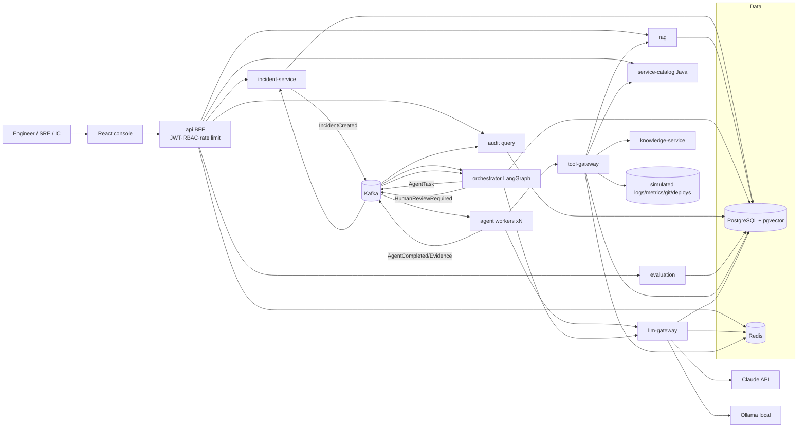
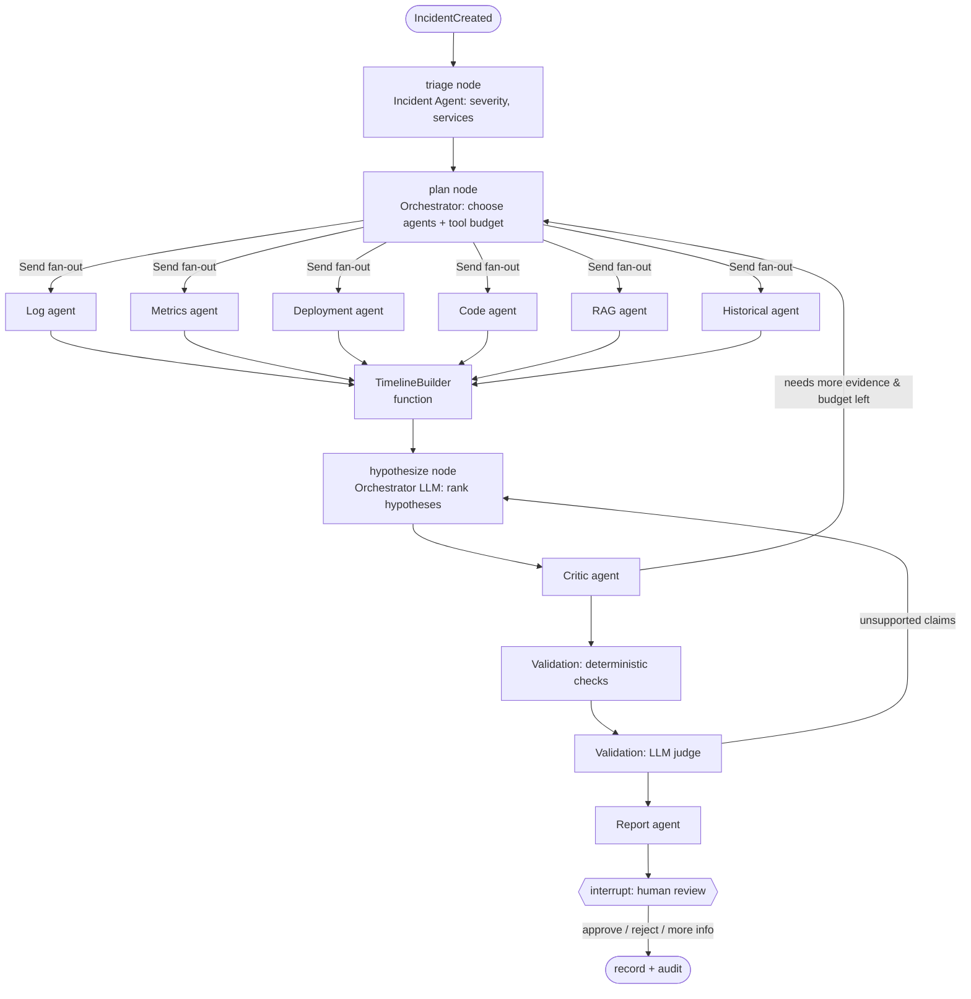
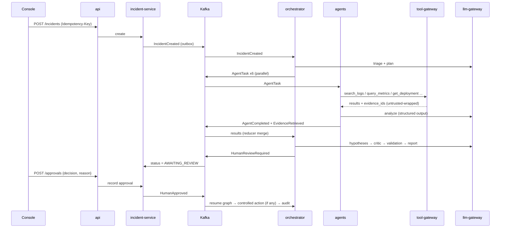

# AEOI Platform — Phase 1: Requirements & Architecture

> AI Engineering Operations & Incident Intelligence Platform. Fictional company: **Northwind Cloud Systems**.
> This document does not describe any real company's internal systems.
> Every design statement is labelled **[P]** Prototype (this repo on a Mac), **[Prod]** Production (one company, one region), or **[Ent]** Enterprise-scale (thousands of services, multi-region).

---

## 0. Review of the original spec (read this first)

You asked me to challenge the design. These are the changes I made to the spec, and the places where I kept the spec but want the cost on record.

| # | Spec says | Problem | Decision |
|---|---|---|---|
| C1 | 11 microservices from day one | One developer, one laptop (Intel, CPU-only). 11 services means 11 Dockerfiles, 11 health models, and distributed debugging before there is any business logic. Interviewers **will** ask "why not a modular monolith?" | **Kept, at your request.** Mitigations: shared `libs/`, one service template (`/new-service` skill), compose profiles, and services built only in the phase that needs them. ADR-011 records the cost and the answer you give in interviews. |
| C2 | Separate API Gateway service | Writing your own gateway duplicates Envoy/Traefik/AWS API Gateway. | `services/api` is a **BFF + auth edge** (JWT, RBAC, rate limit, routing). TLS and load balancing stay in infrastructure (ingress). |
| C3 | Knowledge Service and RAG Service and Service Catalog | Three services overlap on "engineering knowledge". | Service Catalog (Java) = source of truth for entities and edges. Knowledge Service = derived graph and impact traversal only. RAG = unstructured text. Flagged as the **first candidate to merge** in Phase 30. |
| C4 | 12 agents | Three of them are not LLM agents. **Security Agent**: security must be deterministic and must not be skippable, so it is policy code in the Tool Gateway and retrieval layer. A prompt can be talked out of a rule; a policy check cannot. **Incident Agent**: overlaps with the Orchestrator planner. **Timeline**: merging timestamps is code. | **9 LLM agents + 3 deterministic components.** Security → `PolicyEngine`. Incident Agent → kept as a small triage node (severity and services) because it uses the catalog. Timeline → `TimelineBuilder` function node. Validation is split: deterministic citation and schema checks first, then an LLM judge only for "is the claim supported by the evidence". |
| C5 | "Confidence: 86%" | An LLM-written percentage is not calibrated. If you show 86% in an interview, the next question is "86% of what? How did you measure it?" | Confidence is an **evidence-rubric band** (HIGH/MEDIUM/LOW) computed from evidence count, independence, temporal fit and whether there is contradicting evidence. A percentage is shown only after calibration against labelled incidents (Phase 25). |
| C6 | "Search millions of historical records" | True for [Ent]. On a laptop with 500 incidents it is just a claim. | pgvector HNSW is good to roughly 5–10M vectors on one node with enough RAM. The design shows where it breaks (§17) and what replaces it. |
| C7 | Knowledge graph | Graph databases are often added because they look good. | **PostgreSQL edges table + recursive CTE** for ≤3–4 hops. A graph DB is justified only for deep, variable-length traversals at large scale (§9, ADR-012). |
| C8 | Kafka "exactly-once" style guarantees | Exactly-once across DB + Kafka + LLM side effects is not achievable in practice. | **At-least-once + transactional outbox + idempotent consumers (dedupe on `event_id`)**. Say this in interviews; it is the senior answer. |
| C9 | "Deploy to Docker using GitHub Actions" | GitHub-hosted runners cannot deploy to your Mac. | CI builds and pushes images to **GHCR** and deploys to a **kind cluster inside the CI runner** for smoke tests. Local Mac runs `docker compose pull`. Real "deploy" in [Prod] targets AWS EKS (plan only). An optional self-hosted runner on the Mac is documented, not recommended (security). |
| C10 | Terraform in repo layout | No phase builds it. | Plan-only AWS reference. Not applied (cost and risk). |
| C11 | LLM-based "prompt injection detection" as the main defence | Classifiers are bypassable. | Defence in depth. The main control is **capability limits**: the agent cannot do anything dangerous even if fully injected. Detection is a secondary signal. |
| C12 | 31 phases, strictly sequential | Kafka (Phase 18) arrives after 17 phases of services that need to communicate. | ~~In-process event bus until Phase 18.~~ **Corrected in Phase 4:** an in-process bus cannot connect separate processes. The **transactional outbox is the bus**: services write events to their outbox; a relay publishes them through a `Publisher` interface (`log` transport by default, `kafka` with `make up PROFILE=kafka`). Phase 18 adds consumers, DLQ and replay. |

**Intel Mac warning:** no Apple-Silicon GPU, so Ollama runs on the CPU. A 3B model gives roughly 5–15 tokens/sec. That is fine for classification and summaries, too slow for the Critic or Report agents. Routing (§ LLM Gateway) sends reasoning-heavy agents to Claude.

---

## 1. Executive summary

AEOI cuts the time engineers spend **gathering and correlating** evidence during incidents. When an incident is created, an orchestrated set of specialised agents pulls deployments, logs, metrics, traces, code diffs, runbooks and similar past incidents through a governed Tool Gateway. It builds ranked hypotheses, has a Critic agent attack them, validates every claim against cited evidence, and produces an investigation report. Any consequential action requires recorded human approval. Everything is traced and audited.

It is an **evidence assistant, not an autonomous operator**. The product promise is "8 systems searched and correlated in minutes, every claim cited". It is not "AI fixes production".

## 2. Business problem

During an incident, investigation time is spent on:
1. **Context switching** across 8–14 systems (logs, metrics, traces, CI/CD, Git, catalog, runbooks, tickets, past incidents).
2. **Correlation by hand**: lining up a deploy time with an error spike and a config change.
3. **Tribal knowledge**: the engineer who remembers "this happened last spring" is asleep.
4. **Write-up toil**: timelines and postmortems are rebuilt from chat logs afterwards.
5. **Ownership confusion**: who owns the failing dependency?

Investigation (MTTI) is often the largest and most variable part of MTTR. Mitigation is usually fast once the cause is known. AEOI targets MTTI.

## 3. Target users

| Persona | Main job in AEOI | Key permission |
|---|---|---|
| Engineer | Investigate own service, ask the copilot, search code/docs | read logs/code/incidents |
| SRE | Investigate across services, use runbooks, propose remediation | + read infra metrics, propose actions |
| Incident Commander | Run the incident, approve/reject recommendations | + approve consequential actions |
| Engineering Manager | Trends, KPIs, postmortems, eval/cost dashboards | read aggregates, no raw PII |
| Admin / Security | Tool policies, roles, audit, document permissions | manage policy, read audit |

## 4. Business value & KPIs

Every KPI has a defined measurement source. Numbers are measured, never assumed.

| KPI | Definition | Source in AEOI |
|---|---|---|
| MTTI | incident created → first validated hypothesis accepted by a human | `incident_events` |
| MTTR | created → resolved | `incident_events` |
| Evidence retrieval time | investigation started → all agent evidence collected | `agent_executions` |
| Systems searched per incident | distinct tool categories called | `tool_calls` |
| % incidents AI-assisted | investigations run / incidents | `incidents` |
| Human override rate | rejected or modified recommendations / total | `approvals` |
| False hypothesis rate | top hypothesis ≠ final human-confirmed root cause | `feedback` + postmortem label |
| Groundedness / citation accuracy | eval metrics (§20) | `eval` schema |
| Tool / agent failure rate | failed / total | `tool_calls`, `agent_executions` |
| LLM latency, tokens, cost per investigation | per call, rolled up | `model_usage` |

**Before/after comparison design [P]:** run the same 20 labelled synthetic incidents (a) "manual mode", where the UI exposes raw tools only and you time yourself, and (b) AI mode. Report both, with n=20 stated. This is the only honest way to show a productivity claim in a portfolio.

## 5. Functional requirements

| ID | Requirement | Phase |
|---|---|---|
| FR-1 | Create incident (API/alert webhook), auto-triage severity + affected services | 4, 8 |
| FR-2 | Run investigation: plan → parallel agents → hypotheses → critic → validation → report | 9–11 |
| FR-3 | Each finding is typed Fact / Hypothesis / Recommendation with evidence ids | 10–11 |
| FR-4 | Evidence graph: hypothesis ↔ evidence edges, navigable in UI | 10, 17 |
| FR-5 | Incident timeline reconstructed from deploys, config, logs, metrics, alerts, human actions | 12 |
| FR-6 | Historical incident semantic + keyword search with similarities/differences | 13 |
| FR-7 | Code intelligence: index repos, commit/PR analysis, change-impact (`CustomerResponse.address`) | 14 |
| FR-8 | Release risk analysis for a PR/RC — advisory, never blocks deploys | 15 |
| FR-9 | Runbook → investigation-step conversion; actions only via approval flow | 7, 16 |
| FR-10 | Human approval: approve / reject / request more info; full decision record | 16 |
| FR-11 | Engineering copilot (tool-using Q&A with citations) | 10, 17 |
| FR-12 | Hybrid, permission-aware knowledge search across code/docs/runbooks/incidents/APIs | 6 |
| FR-13 | Postmortem generator with evidence references | 12 |
| FR-14 | Agent trace view (agent, model, prompt version, IO, tools, latency, tokens, errors, retries) | 9, 23 |
| FR-15 | Evaluation lab: compare prompt/model/retrieval versions on datasets | 25 |
| FR-16 | MLOps, Security/Audit, KPI dashboards | 17, 23, 25 |
| FR-17 | Service catalog (Java) with dependency graph, consumed by AI services via REST + events | 20 |

## 6. Non-functional requirements

| Category | Target [P] | Target [Prod] |
|---|---|---|
| API latency (non-AI reads) | p95 < 300 ms | p95 < 200 ms |
| Investigation completion | p95 < 3 min (Claude) | p95 < 90 s |
| Copilot first token | < 4 s | < 2 s |
| Availability | best effort | 99.9% for incident-service; AI path degrades gracefully |
| Degradation | if all LLMs are down, incidents, timeline (deterministic), search (keyword) still work | same |
| Durability | Postgres volume | RDS Multi-AZ, PITR 7–35 days, audit retention 1–7 yrs |
| Security | RBAC, permission-aware RAG, audit for 100% of tool calls & approvals | + SSO, mTLS, KMS, DLP |
| Privacy | PII scrubbed before hosted LLMs, embeddings, traces | + data residency per region |
| Cost | ≤ $0.50 per investigation target (measure!) | budget alerts per team |
| Observability | trace every request end-to-end; metrics per agent/tool/model | + SLOs, error budgets |
| Reproducibility | prompt, model, retrieval config and dataset versions recorded per run | same |
| Portability | runs on Intel macOS + Docker Desktop | EKS (reference), maps to AKS/GKE |

## 7. Complete system architecture

```
                       ┌──────────────────────────────────────────────────────────────────┐
  Browser (React) ───► │ api (BFF/edge): JWT, RBAC, rate-limit, idempotency, routing      │
                       └──────┬───────────────┬───────────────────┬───────────────────────┘
                              │REST           │REST               │REST
                 ┌────────────▼───┐   ┌───────▼────────┐   ┌──────▼──────────┐
                 │incident-service│   │ rag (search)   │   │ evaluation      │
                 │ incidents,     │   │ hybrid + perms │   │ datasets, runs  │
                 │ timeline,      │   └───────▲────────┘   └──────▲──────────┘
                 │ approvals      │           │                   │
                 └──────┬─────────┘           │                   │
          outbox→Kafka  │ IncidentCreated     │                   │
   ═════════════════════▼═════════════════════╪═══════════════════╪═════════ Kafka ════════
                 ┌──────────────┐  AgentTask  │ ┌─────────────────┴─┐   all events
                 │ orchestrator │ ──────────► │ │ agents (workers)  │ ────────────► audit
                 │ LangGraph +  │ ◄────────── │ │ log/metrics/code/ │               (append-only)
                 │ checkpoints  │ AgentDone   │ │ deploy/rag/hist/  │
                 └──────┬───────┘             │ │ critic/valid/rep  │
                        │                     │ └───┬──────────┬────┘
                        │ LLM calls           │     │tools     │LLM calls
                 ┌──────▼──────────────────────────▼──┐  ┌────▼─────────────┐
                 │ llm-gateway: Claude | Ollama |      │  │ tool-gateway:    │
                 │ OpenAI-compat | Gemini; routing,    │  │ authz, policy,   │
                 │ cache, budgets, cost accounting     │  │ timeout, audit   │
                 └─────────────────────────────────────┘  └──┬──────────┬────┘
                                                             │          │
                     ┌───────────────────────┐   ┌───────────▼──┐  ┌────▼───────────────────┐
                     │ service-catalog (Java)│◄──┤ knowledge-svc│  │ "external" systems      │
                     │ services/owners/deps  │   │ graph/impact │  │ (simulated): logs,      │
                     └───────────────────────┘   └──────────────┘  │ metrics, git, deploys   │
                                                                   └─────────────────────────┘
   Shared: PostgreSQL 16 + pgvector (schema per service) · Redis · OTel Collector → Prometheus/Tempo → Grafana
```

**External systems are simulated [P]:** logs, metrics, traces, Git and deploy history are synthetic datasets served by tool adapters behind the Tool Gateway (Postgres tables + JSONL files). Swapping in Loki/Prometheus/GitHub APIs is an adapter change. This is the right interview framing: "the gateway contract is real; the backends are simulated".

## 8. Architecture diagram (C4 container view, Mermaid)



---

## 9. Agent architecture

**Pattern: planner + parallel specialists + adversarial review + deterministic gates**, as a LangGraph `StateGraph` with a Postgres checkpointer.



**Why multi-agent here (and not one agent):** (1) the evidence sources are independent, so running them in parallel cuts wall-clock time; (2) each agent gets a narrow tool allow-list (least privilege); (3) small, focused contexts are cheaper and less prone to distraction than one 150k-token context; (4) the Critic needs **independence** from the author of the hypothesis; (5) per-agent evaluation and versioning.

**When NOT to use multi-agent:** simple Q&A ("which runbook applies?") → single retrieval + one LLM call. The copilot uses a **single tool-calling agent**, not the full graph. Most requests should never touch the 12-node graph.

**Loop guards:** max 2 critic→plan cycles, max 1 judge→hypothesize cycle, per-investigation token and $ budget, per-agent timeout. When a budget is exhausted the report is produced with the status `INCONCLUSIVE` and lists the open questions. A partial answer stated honestly is better than an infinite loop.

## 10. Agent responsibilities

| # | Component | Type | Inputs | Tools (allow-list) | Output |
|---|---|---|---|---|---|
| 1 | Orchestrator | LLM (planner) + graph | incident, catalog context | none directly | plan, agent set, ranked hypotheses |
| 2 | Incident (triage) | small LLM (Ollama ok) | alert text, catalog | `query_service_catalog` | severity, affected services, time window |
| 3 | Log Analysis | LLM + code | services, window | `search_logs` | error clusters (code does clustering; LLM labels) → Facts |
| 4 | Metrics | **mostly code** + small LLM | services, window | `query_metrics` | anomalies (z-score/EWMA in code), correlations → Facts |
| 5 | Code Intelligence | LLM | deploy diff, commits | `get_commit`, `get_pull_request`, `search_repository` | changed behaviours → Facts + candidate Hypotheses |
| 6 | Deployment | code + small LLM | services, window | `get_deployment`, `get_config_diff` | deploy/config events → Facts |
| 7 | RAG / Knowledge | retrieval + LLM | symptoms | `search_runbooks`, `search_docs` | runbook steps + citations |
| 8 | Historical Incident | retrieval + LLM | symptoms, services | `search_incidents` | similar incidents, similarities/differences |
| 9 | Security | **PolicyEngine (code)** | every tool call/retrieval | — | allow/deny + reason (audited) |
| 10 | Critic | strong LLM (Claude) | hypotheses + raw evidence | read-only evidence store | supporting/contradicting evidence, alternatives, evidence requests |
| 11 | Validation | code + LLM judge | report draft | evidence store | citation existence, schema, contradiction, unsupported-claim flags |
| 12 | Report | strong LLM | validated state | none | report + postmortem draft |
| — | TimelineBuilder | **code** | all Facts with timestamps | — | ordered timeline |

## 11. Data flow

1. **Write path:** `POST /api/v1/incidents` → api (auth, idempotency) → incident-service writes `incidents` + `outbox` row in **one transaction** → relay publishes `IncidentCreated`.
2. **Investigation:** orchestrator consumes, creates `investigation` + checkpoint, emits `AgentTask` events (key = `incident_id` → ordering per incident).
3. **Evidence:** agents call tool-gateway (authz as the requesting user) → results get `evidence_id`s and are stored in `evidence` (incident-service) → `EvidenceRetrieved`.
4. **Reasoning:** orchestrator aggregates via reducers, then hypothesize → critic → validate → report. Each step is checkpointed.
5. **Human:** `HumanReviewRequired` → UI → `POST /api/v1/approvals` → `HumanApproved/Rejected` → graph resumes from the interrupt.
6. **Audit:** every event is also consumed by audit (append-only).
7. **Telemetry:** OTel context is propagated in HTTP headers and Kafka headers → one trace per investigation.

## 12. Incident investigation flow (sequence)



## 13. RAG architecture

```
Sources (md/pdf/txt/html/json/code/runbooks/incidents)
 → parse (pymupdf, markdown-it, BeautifulSoup, tree-sitter for code)
 → normalise + PII scrub
 → chunk (structure-aware: headings for docs, AST functions/classes for code, steps for runbooks; 300–800 tokens, 10–15% overlap)
 → metadata (document_id, source, title, department, owner, version, created_at, updated_at, allowed_groups[], chunk_id, embedding_model)
 → embed (local nomic-embed-text 768-d [P]; provider configurable)
 → Postgres: document_chunks(embedding vector(768), tsv tsvector, allowed_groups text[])
Query → permission filter (SQL) → [vector top-50 ∪ BM25/FTS top-50] → RRF fusion → rerank (cross-encoder bge-reranker-base, CPU) → top-8
 → context builder (dedupe, token budget, <untrusted_data> wrapping, citation ids) → LLM → citation check
```

**Why hybrid beats pure vector here:** engineering text is full of exact tokens: error codes (`ERR_POOL_TIMEOUT`), class names (`CustomerResponse`), incident ids, version strings. Embeddings blur these, while keyword search matches them exactly. Embeddings handle paraphrase ("DB connections ran out"). RRF fusion gets both without tuning score scales.

**Permission-aware retrieval:** `WHERE allowed_groups && :user_groups` is inside the same SQL statement as the ANN search. Caveat (senior detail): with HNSW, a selective filter can return fewer than *k* results because filtering happens after the graph walk. Fixes: pgvector ≥0.8 iterative scans (`hnsw.iterative_scan`), partitioning by sensitivity tier, or over-fetch. There is a test that asserts leakage = 0 at the repository layer.

## 14. Tool Gateway architecture

```
Agent ─► ToolClient.call(name, args, ctx{user, roles, incident_id, agent, approval_id?})
      ─► tool-gateway: 1 registry lookup → 2 input schema validate (bounded) → 3 authz (user perms ∩ agent allow-list)
         → 4 policy (side_effect class, env, rate limit, egress allow-list, approval required?) → 5 execute with timeout/retry/circuit breaker
         → 6 output: size cap, PII redaction, wrap as untrusted, assign evidence_ids → 7 audit (tool_calls + audit event) → result
```

Tool contract fields: name, description, input_schema, output_schema, required_permissions, side_effect (READ/WRITE/CONSEQUENTIAL), timeout_s, retry_policy, idempotent, audit_fields, redaction_rules.
**Key invariant:** effective permission = **user permissions ∩ agent allow-list**. An agent acting for an Engineer can never do more than that Engineer could.

## 15. Security architecture

| Layer | Control |
|---|---|
| Identity | OIDC/OAuth2 JWT. [P]: Keycloak in compose **or** a local dev token issuer (lighter; recommended on Intel Mac). [Prod]: corporate IdP (SSO). |
| Service-to-service | [P]: signed service JWT (client-credentials). [Prod]: mTLS via service mesh + workload identity. |
| RBAC | permission strings (`logs:read`, `incidents:approve`, `actions:request`, `actions:execute`, `docs:read:security`) mapped to roles. |
| Data | schema-per-service DB roles; audit table append-only (REVOKE UPDATE, DELETE); row-level permission filters for documents. |
| Secrets | `.env.local` + Docker secrets [P]; AWS Secrets Manager + External Secrets Operator [Prod]. |
| PII | Presidio-style detector + regex in `libs/security`; applied before embedding, hosted LLM, traces. |
| LLM I/O | untrusted-data wrapping, output schema validation, URL/egress allow-list, no tool call with args copied from retrieved text without validation. |
| Abuse | Redis token-bucket per user/tool/route; LLM $ budget per investigation and per user/day. |
| Audit | every tool call, retrieval (doc ids), approval, policy denial → audit service. |

**Role matrix**

| Permission | ENGINEER | SRE | INCIDENT_COMMANDER | MANAGER | ADMIN |
|---|---|---|---|---|---|
| read incidents/logs/code | ✔ | ✔ | ✔ | aggregates | ✔ |
| run investigation | ✔ | ✔ | ✔ | ✖ | ✔ |
| request remediation | ✖ | ✔ | ✔ | ✖ | ✖ |
| approve consequential action | ✖ | ✖ | ✔ | ✖ | ✖ (separation of duties) |
| execute production command | ✖ | ✖ | via approved controlled tool only | ✖ | ✖ |
| manage policies/roles | ✖ | ✖ | ✖ | ✖ | ✔ |
| read audit | own | own | incident | team | all |

Note: ADMIN cannot approve production actions. Admins should not be able to approve their own policy changes either (**separation of duties**). This is a good interview point.

## 16. Prompt-injection defence & human-in-the-loop

**Injection defence (defence in depth):**
1. **Capability limits (main control):** agents only have read tools. Consequential tools need a server-verified `approval_id` bound to (action, args hash, incident, approver). Even a fully hijacked agent cannot act.
2. **Channel separation:** system prompt = instructions; retrieved/tool text is passed only inside `<untrusted_data>` blocks, with an explicit clause that this content can never change instructions.
3. **Output validation:** structured output schemas; reject tool args or URLs that appear only in untrusted text; egress allow-list in the tool gateway.
4. **Detection (secondary):** heuristic + classifier flags on ingested docs (quarantine flag, visible in UI).
5. **Tests:** adversarial fixtures in CI (`tests/security`).

**Human-in-the-loop flow:**
`Recommendation(requires_approval=true)` → LangGraph `interrupt()` → incident status `AWAITING_REVIEW` → IC sees finding + confidence band + evidence + contradicting evidence + alternatives → **Approve / Reject / Request more information** (reason is mandatory) → `approvals` row {approver_id, role, timestamp, decision, reason, recommendation snapshot, evidence_ids, args_hash} → if approved: controlled tool executes with the approval_id → result and audit event → graph resumes.
"Request more information" re-enters the plan node with the human's question as a new constraint.
Approvals expire (e.g. 30 min) and are single-use. A stale approval cannot be replayed.

## 17. Distributed system architecture

**Topics** (key = `incident_id` unless noted; retention 7d [P]):

| Topic | Events | Producers → Consumers | Partitions [P]/[Prod] |
|---|---|---|---|
| `incident.lifecycle` | IncidentCreated, IncidentResolved, HumanReviewRequired, HumanApproved, HumanRejected | incident-service → orchestrator, audit, eval | 3 / 24 |
| `investigation.tasks` | AgentTask | orchestrator → agents | 6 / 48–96 (≥ max worker replicas) |
| `investigation.results` | AgentStarted, AgentCompleted, AgentFailed, EvidenceRetrieved, HypothesisCreated, HypothesisChallenged, ValidationCompleted | agents/orchestrator → orchestrator, audit, incident | 6 / 48 |
| `catalog.changes` (key = service_id) | CatalogChanged | service-catalog → knowledge, tool-gateway cache | 3 / 12 |
| `*.dlq` | poison messages + error metadata | consumers → ops replay tool | 1 / 6 |

**Event envelope** (`libs/models`): `event_id (UUIDv7)`, `event_type`, `schema_version`, `occurred_at`, `correlation_id`, `causation_id`, `incident_id`, `actor`, `traceparent`, `payload`.

**Reliability patterns**

| Pattern | Implementation |
|---|---|
| Atomic publish | transactional outbox table + relay (poll [P]; Debezium CDC [Ent]) |
| Idempotency | consumer `processed_events(event_id PK)` insert in the same tx as the side effect; HTTP `Idempotency-Key` |
| Retries | in-consumer retry 3× exp backoff + jitter → retry topic → DLQ |
| Timeouts | every HTTP/LLM/tool call; agent task deadline in the event |
| Circuit breakers | per downstream (LLM provider, tool backend); open → fallback (other provider / partial result) |
| Backpressure | consumers pull (Kafka's natural backpressure); bounded in-flight per worker; LLM gateway concurrency semaphore + 429 to callers; HPA/KEDA on lag |
| Correlation | `correlation_id` = investigation id, in logs, spans, events, audit |
| Checkpointing | LangGraph PostgresSaver after every node; resume on redelivery |

**Scale stages**

| Load | What changes |
|---|---|
| 10 rps [P] | single broker, 1–2 workers, one Postgres. The bottleneck is **LLM latency**, not infra. |
| 100 rps [Prod] | 3-broker cluster, 10–30 workers, PgBouncer, read replica for search, Redis cache for retrieval + LLM responses. Bottleneck: **LLM provider rate limits (TPM)**, so you need a token-budget scheduler, model routing and multiple provider accounts. |
| 1,000 rps [Ent] | Note: 1,000 *investigations*/s is not realistic. 1,000 rps is copilot/search traffic plus event ingestion. Separate read path (search) from investigation path, a dedicated vector store or sharded pgvector, priority queues (SEV-1 first), per-tenant quotas, multi-region. Bottlenecks: vector search memory, Postgres write amplification from audit (move audit to a log store such as S3 + Athena or ClickHouse). |

## 18. Database architecture

One Postgres instance [P], **schema per owning service**. Tables (spec list) mapped to owners:

| Schema (owner) | Tables |
|---|---|
| `identity` (api) | users, roles, permissions, user_roles, role_permissions |
| `catalog` (service-catalog, Flyway) | services, repositories, service_dependencies, apis, teams |
| `incident` | incidents, incident_events, evidence, hypotheses, hypothesis_evidence, approvals, feedback, outbox, processed_events |
| `orchestrator` | investigations, tasks, agent_executions, messages (+ LangGraph checkpoint tables, Phase 9) |
| `rag` | documents, document_chunks, runbooks (steps as JSONB), historical_incidents (+ embedding) |
| `devdata` (tool-gateway simulated sources) | deployments, commits, pull_requests, log_events, metric_points |
| `tools` | tool_calls |
| `llm` | model_usage, prompt_versions |

> Phase 3 implementation notes: full table/column/index reference in [`docs/data-model.md`](docs/data-model.md). `services`/`repositories` live in `catalog` (Java, Phase 20); until then `data/generated/catalog.json`.
| `audit` | audit_events (append-only, monthly partitions) |
| `eval` | datasets, eval_cases, eval_runs, evaluations |

**Important indexes (each justified):**

| Index | Serves |
|---|---|
| `incidents (status, severity, created_at DESC)` | dashboard "open incidents by severity, newest first" |
| `incident_events (incident_id, occurred_at)` | timeline reconstruction (range scan per incident) |
| `evidence (incident_id, kind)` + `hypothesis_evidence (hypothesis_id)` PK | evidence graph |
| `document_chunks USING hnsw (embedding vector_cosine_ops)` | ANN retrieval |
| `document_chunks USING gin (tsv)` | keyword/BM25-style retrieval |
| `document_chunks USING gin (allowed_groups)` | permission filter `&&` |
| `historical_incidents USING hnsw (embedding …)` + `(service_id, occurred_at)` | similar-incident search, scoped by service |
| `deployments (service_id, deployed_at DESC)` | "recent deploys for service X before T" |
| `log_events (service_id, ts) ` BRIN on ts | big time-ordered table; BRIN is tiny and fits append-only data |
| `tool_calls (incident_id, created_at)` | agent trace view |
| `audit_events (actor_id, occurred_at)` + partition by month | audit queries + cheap retention (drop partition) |
| `outbox (published_at) WHERE published_at IS NULL` partial | relay polling only scans unpublished rows |
| `processed_events (event_id)` PK | consumer dedupe |
| `approvals (incident_id, created_at)` + unique `(approval_id)` single-use | approval lookup + replay protection |

**Graph question (Feature 9):** `catalog.service_dependencies(src, dst, kind)` + recursive CTE answers "what depends on X within 3 hops" in milliseconds for 100–10k services. A graph DB (Neo4j/Neptune) earns its place when you need variable-depth path queries over 10⁶+ edges, graph algorithms (centrality, community), or many edge types that change often. Neither applies here [P/Prod]. → ADR-012.

**Redis:** response cache (LLM: key = hash(model, prompt_version, inputs)); retrieval cache; idempotency keys; token-bucket rate limits; short-lived locks (`SET NX PX`, e.g. "one investigation per incident"). Redis is **not** a source of truth. If Redis is down: rate limiting fails open for reads and closed for consequential actions, and caches are bypassed.

## 19. Observability architecture

```
services (OTel SDK: traces, metrics, logs w/ trace_id) → OTel Collector
   → traces: Tempo (or Jaeger) [P]   → metrics: Prometheus   → logs: Loki (optional; stdout JSON otherwise)
   → Grafana dashboards: Platform health · Investigation funnel · Agents · LLM cost/tokens · Tool gateway · RAG quality · Kafka lag · KPIs
```
Span attributes follow OTel GenAI semantic conventions where they exist (`gen_ai.request.model`, `gen_ai.usage.input_tokens`, …) plus `aeoi.agent`, `aeoi.agent_version`, `aeoi.prompt_version`, `aeoi.tool`, `aeoi.evidence_count`, `aeoi.retries`.
**Content logging:** prompts and outputs are stored (scrubbed) in `agent_executions`, **not** in span attributes. This avoids leaking PII into the tracing backend and controls cost.
RAM note [P]: Prometheus + Grafana + Tempo ≈ 1 GB. They have their own compose profile and are off by default.

## 20. MLOps architecture

| Tracked artefact | Where |
|---|---|
| model id + provider, prompt version (`prompts/<agent>/vN.md` + content hash), agent version, embedding model + dim, retrieval config (k, fusion, reranker), dataset version | every `agent_executions` / `model_usage` / `eval_runs` row |
| Prompt registry | `prompts/registry.yaml` (git is the registry [P]; ADR covers why not a SaaS prompt tool) |

**Evaluation metrics (definitions):**
- *Answer correctness*: top hypothesis matches the labelled root cause (exact category match + LLM-judge for free text).
- *Retrieval relevance*: recall@k, MRR against labelled relevant chunk ids.
- *Groundedness*: share of claims in the report supported by the cited evidence (claim extraction + NLI/judge).
- *Citation accuracy*: cited ids exist, are accessible to the user, and support the sentence.
- *Hallucination rate*: claims with no supporting evidence / total claims.
- *Tool success*: successful tool calls / total; *latency* p50/p95; *cost* $ per investigation.

**Eval lab flow:** dataset vN (synthetic incidents with planted ground truth) → run config A and B (same seed) → metrics + bootstrap CI → stored → dashboard comparison. Gate in CI: a smoke eval on 10 cases with a recorded-response cache (cheap). The full eval runs nightly or on demand (it costs money).
**Do not fabricate results.** The spec's "v12 91% vs v13 94%" is an example layout only.

## 21. Local macOS architecture (Intel x86_64)

| Component | How it runs | RAM (approx) |
|---|---|---|
| Postgres 16 + pgvector | `pgvector/pgvector:pg16` container | 512 MB–1 GB |
| Redis 7 | container | 64 MB |
| Kafka (KRaft, 1 broker) | `apache/kafka` container | 1 GB (heap capped) |
| 10 Python services | containers or `uv run` on the host for the service being debugged | 150–250 MB each |
| service-catalog (JVM) | container, `-XX:MaxRAMPercentage=60`, 512 MB limit | 512 MB |
| Frontend | `npm run dev` on the host | — |
| Ollama | **native on macOS** (not in Docker: Docker on Mac cannot use the host CPU features as efficiently) | 3–4 GB with a 3B model |
| Observability | optional profile | ~1 GB |

Recommended Docker Desktop allocation: **10 GB RAM, 6 CPUs** for `full`; 6 GB for `core`. Run the service you are debugging on the host with `uv run`, and everything else in compose.

## 22. Kubernetes architecture

Namespace `ai-engineering-platform`. Kustomize `base/` + `overlays/{dev,staging,prod}`.
- **Deployments** for every service; **StatefulSets only for local in-cluster infra** (Postgres/Kafka/Redis in kind). In [Prod] these are managed services (RDS, MSK, ElastiCache), not run in the cluster.
- **Services** (ClusterIP); **Ingress** (ingress-nginx [P], AWS ALB [Prod]) → api + frontend only. Nothing else is exposed.
- **ConfigMaps** for non-secret config; **Secrets** via External Secrets Operator [Prod] (plain Secrets in kind only).
- **Probes:** liveness = process alive (no dependency checks, or a DB outage restarts every pod); readiness = can serve (DB/Kafka reachable).
- **Resources:** requests = typical usage, limits = memory only for Python (CPU limits cause throttling under bursts; there is an argument in the ADR).
- **Scaling:** HPA on CPU for api/rag; **agent workers scale on Kafka consumer lag** (KEDA [Prod]; HPA CPU fallback in kind). Max replicas ≤ partitions of `investigation.tasks`.
- **PDB** for multi-replica services; **NetworkPolicies**: agents can reach only tool-gateway, llm-gateway and Kafka.
- **PVC** for Postgres/Kafka in kind only.
- **Zero-downtime:** rolling update `maxUnavailable: 0`, readiness gates, `preStop` sleep + graceful Kafka consumer close, expand/contract DB migrations run as a pre-deploy Job.

## 23. CI/CD architecture (GitHub Actions)

```
PR:    checkout → ruff → mypy → pytest unit → (Java) mvn verify → (frontend) lint/test
       → integration tests (Testcontainers) → security: gitleaks, pip-audit, Trivy fs, CodeQL
       → smoke eval (cached LLM responses)
main:  → docker buildx (amd64+arm64) → Trivy image scan → push GHCR (tag = git SHA + semver)
       → deploy dev: kind-in-runner, kubectl apply -k overlays/dev → smoke tests (health + demo incident)
tag vX.Y.Z: → staging (env approval) → production (required reviewers) [Prod: EKS via OIDC, no long-lived keys]
```
- Versioned deployments: immutable image tags (SHA), Kustomize image overrides, release notes generated from conventional commits.
- Path filters: only build services whose files changed (monorepo).
- Environments: `development`, `staging`, `production` as GitHub Environments with protection rules.
- Your local flow: `docker compose pull && docker compose --profile core up -d` pulls exactly the images CI built.

## 24. Repository structure

```
ai-engineering-platform/
├── AGENTS.md  CLAUDE.md  CLAUDE.local.md.example  README.md  architecture.md  Makefile  .mcp.json
├── .claude/ {settings.json, hooks/, rules/, skills/, agents/, commands/, output-styles/}
├── services/ {api, incident-service, orchestrator, agents, rag, llm-gateway, tool-gateway,
│              knowledge-service, audit, evaluation, service-catalog(Java)}   ← each has CLAUDE.md
├── libs/ {common, models, security, observability}
├── prompts/            # versioned prompts + registry.yaml
├── frontend/
├── infrastructure/ {docker, kubernetes, terraform(plan-only)}
├── data/ {sample-incidents, sample-logs, sample-documents(+adversarial), sample-repositories, eval}
├── tests/ {unit, integration, security, evaluation, e2e}  (+ load, chaos later)
├── docs/ {adr/, interview/, demo/, roadmap.md, claude-code-setup.md}
├── scripts/ {doctor.sh, synth/}
├── .github/workflows/ {claude.yml, (ci.yml, cd.yml in Phase 24)}
└── docker-compose.yml (Phase 2/21)
```
Change vs spec: added `prompts/` (prompt versioning needs a home) and `knowledge-service` (in the spec's service list but missing from its tree).

## 25. Technology selection

| Concern | Choice | Why (one line) |
|---|---|---|
| AI services | Python 3.12, FastAPI, Pydantic v2, uv | AI ecosystem + async IO + typed contracts; uv = fast reproducible envs |
| Orchestration | LangGraph | stateful graph, checkpoints, parallel `Send`, `interrupt()` for HITL |
| LLM (reasoning) | Anthropic Claude (configurable) | strong long-context reasoning + tool use; Critic/Report quality matters most |
| LLM (cheap/offline) | Ollama `llama3.2:3b` (CPU) | triage/labelling without cost; offline dev |
| Embeddings | `nomic-embed-text` (local, 768-d) | free, private, good enough; provider swappable |
| Reranker | `bge-reranker-base` cross-encoder (CPU) | measurable precision lift; must be measured on our eval set |
| DB + vectors | PostgreSQL 16 + pgvector | one system for relational, FTS, vectors, permissions in one query |
| Events | Kafka (KRaft) | durable log, replay, partition ordering, consumer groups; Java ecosystem fit |
| Cache/limits | Redis 7 | cache, token buckets, locks, idempotency keys |
| Enterprise service | Java 21 + Spring Boot 3 + Flyway | demonstrates integration with the existing Java estate |
| Frontend | React + TS + Vite + TanStack Query | standard, typed, fast dev loop |
| Observability | OpenTelemetry → Prometheus/Tempo → Grafana | vendor-neutral instrumentation |
| Containers/orchestration | Docker Compose [P], kind + Kustomize, EKS [Prod] | same manifests from laptop to cloud |
| CI/CD | GitHub Actions + GHCR | owner's requirement; OIDC to cloud |
| Testing | pytest, Testcontainers, Playwright, Locust/k6, Toxiproxy | each covers a layer the others can't |

**Cloud reference = AWS** (owner's ecosystem familiarity; richest managed Kafka/pgvector options):

| Need | AWS (reference) | Azure | GCP |
|---|---|---|---|
| Kubernetes | EKS | AKS | GKE |
| PostgreSQL + pgvector | RDS / Aurora PostgreSQL | Azure Database for PostgreSQL Flexible | Cloud SQL / AlloyDB |
| Redis | ElastiCache (Valkey/Redis) | Azure Cache for Redis | Memorystore |
| Kafka | MSK | Event Hubs (Kafka API) / Confluent | Managed Service for Apache Kafka / Confluent |
| Object storage | S3 | Blob Storage | GCS |
| Secrets | Secrets Manager + KMS | Key Vault | Secret Manager + KMS |
| Monitoring | CloudWatch + Managed Prometheus + Managed Grafana | Azure Monitor + Managed Grafana | Cloud Monitoring + Managed Prometheus |
| Load balancing | ALB (AWS LB Controller) | Application Gateway | Cloud Load Balancing |
| LLM | Anthropic API or Claude on Bedrock | Claude via Azure AI Foundry (check availability) / OpenAI | Claude on Vertex AI / Gemini |

## 26. Technology tradeoffs (the honest version)

| Choice | Strongest argument against | Why we still choose it / mitigation |
|---|---|---|
| 11 microservices | operational complexity ≫ team size | owner's explicit choice; template + profiles; ADR-011 records the monolith-first answer |
| LangGraph | framework lock-in, API churn, abstraction overhead vs plain asyncio | checkpointing + HITL interrupt + parallel fan-out would be ~1–2k lines to rebuild; isolate it behind `orchestrator` only |
| pgvector | weaker than dedicated vector DBs at 10⁸ vectors, filtered-HNSW recall issue | permissions + FTS + metadata in one transaction; migrate path documented |
| Kafka | heavy on a laptop (JVM), ops cost | durable replay + DLQ + consumer groups needed for workers and audit; Redpanda is a drop-in alternative if RAM is tight |
| Claude for reasoning | cost, external dependency, data leaves the machine | PII scrubbing, budget caps, Ollama fallback, provider abstraction |
| Java service | second toolchain | realistic integration story; isolated to one service |
| Multi-agent | more LLM calls, latency, harder to debug | parallelism + least privilege + independent critic; single-agent path for simple queries |
| Kubernetes | overkill for a portfolio | required to show worker autoscaling and zero-downtime; run in kind only |

## 27. ADR list

| ADR | Title | Status |
|---|---|---|
| ADR-001 | Use LangGraph for investigation orchestration | Proposed |
| ADR-002 | PostgreSQL + pgvector for relational, full-text and vector data | Proposed |
| ADR-003 | Kafka for asynchronous events (at-least-once + outbox + idempotent consumers) | Proposed |
| ADR-004 | FastAPI for Python services | Proposed |
| ADR-005 | Java 21 / Spring Boot for the Service Catalog | Proposed |
| ADR-006 | Permission-aware retrieval enforced in SQL | Proposed |
| ADR-007 | Mandatory human-in-the-loop for consequential actions | Proposed |
| ADR-008 | Tool Gateway as the only path from agents to systems | Proposed |
| ADR-009 | Kubernetes (kind locally, EKS reference) | Proposed |
| ADR-010 | OpenTelemetry for traces/metrics/logs | Proposed |
| ADR-011 | Eleven services from day one (vs modular monolith) — cost acknowledged | Proposed |
| ADR-012 | Postgres edges + recursive CTE for knowledge graph (no graph DB) | Proposed |
| ADR-013 | One Alembic migration stream for all service-owned schemas (for now) | Proposed (Phase 3) |
| ADR-014 | LLM routing policy, fallback and cost accounting in one gateway | Proposed (Phase 5) |
| ADR-016 | Hybrid retrieval in one SQL statement, RRF fusion, eval-gated LLM rerank | Proposed (Phase 6) |
| ADR-017 | Tool Gateway: on-behalf-of authz (user ∩ agent allow-list), fail-closed audit via outbox | Proposed (Phase 7) |
| ADR-015 *(planned)* | Evidence-rubric confidence bands instead of LLM percentages | to write in Phase 11 |

## 28. Development roadmap
See [`docs/roadmap.md`](docs/roadmap.md): 31 phases, each with a **Verify** gate. Main changes: an in-process event bus with the Kafka interface from Phase 4; services are created only in the phase that needs them.

## 29. Interview competency map
See [`docs/interview/competency-map.md`](docs/interview/competency-map.md): every spec interview question is mapped to the component, phase and artefact that lets you answer it with evidence.

## 30. Final 10-minute demo scenario
See [`docs/demo/demo-scenario.md`](docs/demo/demo-scenario.md).

---
### Phase 1 exit checklist
- [ ] You have read §0 and accept or reject each challenge (C1–C12)
- [ ] ADR-001…012 reviewed; any you disagree with are changed **before** status → Accepted
- [ ] `make doctor` passes on your Mac (or the gaps are known)
- [ ] Docker Desktop memory set (≥ 6 GB core / 10 GB full)
- [ ] Decide auth for [P]: dev token issuer (recommended) vs Keycloak
