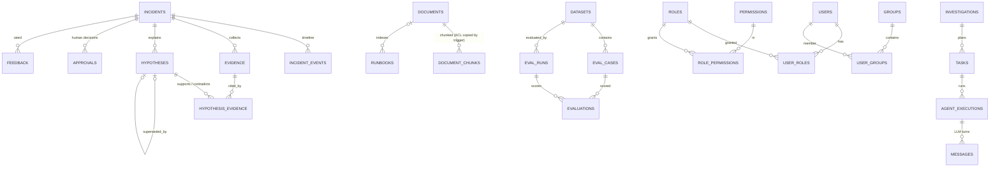

# AEOI data model (Phase 3)

> Generated from the ORM + migrations, then annotated. Source of truth: `libs/db/src/aeoi_db/models/`
> and `libs/db/alembic/versions/`. Index reasons also live **in the database** (`COMMENT ON INDEX`),
> and `tests/integration/db/test_schema_rules.py` fails if an index has no reason.

## Conventions (and why)
| Convention | Why |
|---|---|
| One schema per owning service; role `svc_<service>` writes only its schema | Ownership is enforced by Postgres privileges, not by trust. Tested in `test_roles.py`. |
| No foreign keys across schemas | Services reference each other's data by id/key and resolve it via API/events. A cross-schema FK would couple deploys and break the split into separate databases later. Tested. |
| UUIDv7 primary keys, generated in the app | Time-ordered → inserts append to the right side of the B-tree (less page splitting than v4); ids can be created before the INSERT (outbox, idempotency). |
| Human keys next to UUIDs (`INC-10234`, `DEPLOY-4821`, `RUNBOOK-DB-012`) | People and LLM citations use short keys; joins use UUIDs. |
| Status/kind = `TEXT + CHECK`, not `ENUM` | Adding a value is a constraint swap in a normal transaction; `ALTER TYPE ... ADD VALUE` has transaction limits. |
| Every FK column has a leading index | Deletes/joins on the parent never scan the child. Tested. |
| `updated_at` maintained by trigger | Can't be forgotten or faked by app code. |
| Rules that protect safety are DB constraints too | e.g. a consequential tool call without approval cannot even be recorded; HIGH confidence rules live in Pydantic (app) because they need evidence objects. |

## Schemas and ownership
| Schema | Owner service | DB role | Read by `aeoi_readonly` (Claude MCP)? |
|---|---|---|---|
| `identity` | api | `svc_api` | **no** (people / audit data) |
| `incident` | incident-service | `svc_incident` | yes |
| `orchestrator` | orchestrator | `svc_orchestrator` | yes |
| `rag` | rag | `svc_rag` | yes |
| `devdata` | tool-gateway | `svc_tool_gateway` | yes |
| `tools` | tool-gateway | `svc_tool_gateway` | yes |
| `llm` | llm-gateway | `svc_llm_gateway` | yes |
| `audit` | audit | `svc_audit (INSERT+SELECT only)` | **no** (people / audit data) |
| `eval` | evaluation | `svc_evaluation` | yes |
| `catalog` | service-catalog (Java, Flyway) | Phase 20 | — |

## Entity relationships (within schemas)

Cross-schema links are **soft** (plain ids/keys): `investigations.incident_id`, `tool_calls.incident_id/approval_id`, `evidence.tool_call_id`, `audit_events.incident_id`, and every `service_key`.

## Tables

### `identity`
| Table | Purpose | Columns |
|---|---|---|
| `groups` | Access groups (e.g. security-team). Documents list the groups allowed to read them. | 2 |
| `permissions` | Permission strings checked by routes and the Tool Gateway | 2 |
| `role_permissions` | Role → permission matrix (architecture.md §15) | 2 |
| `roles` | RBAC roles (reference data, migration 0012) | 2 |
| `user_groups` | Group membership (drives document access) | 3 |
| `user_roles` | Role assignments | 4 |
| `users` | People (OIDC subject is the stable identity) | 6 |

### `incident`
| Table | Purpose | Columns |
|---|---|---|
| `approvals` | Human decision on a consequential recommendation (Feature 11, ADR-007). | 16 |
| `evidence` | A piece of evidence retrieved during an investigation. Findings cite evidence_key. | 14 |
| `feedback` | Thumbs up/down on findings, reports, answers, retrievals | 8 |
| `hypotheses` | Ranked explanations with a confidence band and status | 9 |
| `idempotency_keys` | Stored result of a POST with an Idempotency-Key, scoped by (principal, scope, key); same transaction as the result (Phase 4, migration 0013) | 8 |
| `hypothesis_evidence` | Evidence graph edge: hypothesis --SUPPORTS/CONTRADICTS--> evidence. | 4 |
| `incident_events` | Timeline entries (deploys, alerts, human actions, agent steps). | 10 |
| `incidents` | System of record for incidents; `number` gives the human key INC-n; optimistic locking via `version` | 13 |
| `outbox` | Transactional outbox: written in the SAME transaction as the state change (ADR-003). | 10 |
| `processed_events` | Consumer-side dedupe: insert in the same tx as the side effect; conflict = duplicate. | 3 |

### `orchestrator`
| Table | Purpose | Columns |
|---|---|---|
| `agent_executions` | What an agent actually did: model, prompt version, tokens, latency, cost (Feature 12). | 17 |
| `investigations` | One AI investigation run with budget and outcome | 9 |
| `messages` | Scrubbed LLM conversation turns of an execution (debugging/replay; NOT in traces). | 7 |
| `tasks` | One unit of agent work (an AgentTask event). Idempotent on idempotency_key. | 12 |

### `rag`
| Table | Purpose | Columns |
|---|---|---|
| `document_chunks` |  | 11 |
| `documents` | Source documents with ACL (`allowed_groups`), sensitivity, quarantine flag + reason (0015) | 16 |
| `historical_incidents` | Closed past incidents (Feature 8). root_cause_category doubles as eval ground truth. | 16 |
| `runbooks` |  | 8 |

### `devdata`
| Table | Purpose | Columns |
|---|---|---|
| `commits` | Simulated git commits | 9 |
| `deployments` | Simulated CD history | 11 |
| `log_events` | Append-only, time-ordered. [Prod]: daily partitions + retention, or a real log store. | 8 |
| `metric_points` |  | 4 |
| `pull_requests` | Simulated PRs | 11 |

### `tools`
| Table | Purpose | Columns |
|---|---|---|
| `tool_calls` | Every Tool Gateway call, allowed or denied | 16 |

### `llm`
| Table | Purpose | Columns |
|---|---|---|
| `model_usage` | Every LLM call attempt: model, tokens, latency, cost, status. Append-only for `svc_llm_gateway` (0014) | 17 |
| `prompt_versions` | Registry mirror of prompts/<agent>/vN.md (git is the source; this is for joins). | 5 |

### `audit`
| Table | Purpose | Columns |
|---|---|---|
| `audit_events` |  | 11 |

### `eval`
| Table | Purpose | Columns |
|---|---|---|
| `datasets` | Versioned evaluation datasets | 5 |
| `eval_cases` | Labelled cases in a dataset | 5 |
| `eval_runs` | One evaluation run with its full config hash | 10 |
| `evaluations` | One metric value for one case in one run (long format: easy to add metrics). | 6 |

## Index reasons (also stored as `COMMENT ON INDEX`)
| Index | Reason |
|---|---|
| `audit.ix_audit_events_actor_occurred_at` | serves: "everything actor X did" (security investigations), newest first |
| `audit.ix_audit_events_correlation_id` | serves: follow one request end-to-end across services |
| `audit.ix_audit_events_incident_id_occurred_at` | serves: audit trail tab of an incident |
| `devdata.ix_commits_repository_committed_at` | serves: get_commit history for a repository, newest first |
| `devdata.ix_commits_service_key_committed_at` | serves: "what changed in service X between two deploys" |
| `devdata.ix_deployments_service_key_environment_started_at` | serves: get_deployment(service, env, before T) - "recent deploys of X, newest first" |
| `devdata.ix_deployments_started_at` | serves: correlate deploys in a time window across all services (incident triage) |
| `devdata.ix_log_events_errors` | serves: error-only log scans (most investigation queries); partial index = much smaller |
| `devdata.ix_log_events_service_key_ts` | serves: search_logs(service, time range) - the main access path |
| `devdata.ix_log_events_ts_brin` | serves: cross-service time-window scans; BRIN is tiny on append-only time data |
| `devdata.ix_pull_requests_merge_commit_sha` | serves: "PR that produced commit X" (release risk analysis) |
| `eval.ix_eval_runs_dataset_id_started_at` | serves: "runs of dataset X, newest first" (A/B comparison picker) |
| `eval.ix_evaluations_case_id` | serves: FK lookup + "how did case X score across runs" |
| `identity.ix_role_permissions_permission_name` | serves: "which roles grant permission X" (PK covers role -> permissions) |
| `identity.ix_user_groups_group_name` | serves: "members of group X" (ACL audits); PK covers user -> groups at login |
| `identity.ix_user_roles_role_name` | serves: "who has role X" (e.g. list incident commanders); PK covers user -> roles |
| `identity.ix_users_email` | serves: login lookup by email (case-normalised) |
| `incident.ix_approvals_incident_id_requested_at` | serves: approval history per incident (UI + audit) |
| `incident.ix_evidence_incident_id_kind` | serves: evidence explorer filtered by kind within one incident |
| `incident.ix_feedback_incident_id` | serves: FK lookups / feedback per incident |
| `incident.ix_feedback_target_type_target_id` | serves: feedback for a given finding/report (eval + UI) |
| `incident.ix_hypotheses_incident_id_rank` | serves: ranked hypotheses for an incident (report + UI) |
| `incident.ix_hypotheses_superseded_by` | serves: FK lookup when following supersession chains |
| `incident.ix_hypothesis_evidence_evidence_id` | serves: reverse edge "which hypotheses use this evidence" (graph view, impact of retracting evidence); the PK already serves hypothesis -> evidence |
| `incident.ix_incident_events_incident_id_occurred_at` | serves: timeline reconstruction = range scan per incident in time order |
| `incident.ix_idempotency_keys_expires_at` | serves: cleanup job deleting expired idempotency keys |
| `incident.ix_incidents_created_at_id` | serves: unfiltered incident list, keyset pagination (created_at, id) newest first |
| `incident.ix_incidents_affected_services` | serves: "incidents affecting service X" (array containment @>) |
| `incident.ix_incidents_status_severity_created_at` | serves: dashboard "open incidents by severity, newest first" |
| `incident.ix_outbox_unpublished` | serves: outbox relay polling of unpublished events; partial so it holds only the backlog |
| `incident.uq_approvals_pending_action` | enforces: at most one PENDING approval for the same action+args on an incident |
| `llm.ix_model_usage_created_at_brin` | serves: time-window rollups across all models; BRIN fits append-only data |
| `llm.ix_model_usage_investigation_id` | serves: cost per investigation (KPI) |
| `llm.ix_model_usage_model_created_at` | serves: cost/latency dashboards by model over time |
| `orchestrator.ix_agent_executions_agent_name_started_at` | serves: per-agent latency/cost dashboards over time |
| `orchestrator.ix_agent_executions_task_id` | serves: agent trace view for a task |
| `orchestrator.ix_investigations_incident_id_started_at` | serves: "investigations for incident X, latest first" (incident page) |
| `orchestrator.ix_tasks_investigation_id` | serves: fan-in "all tasks of investigation X" |
| `orchestrator.ix_tasks_live_deadline` | serves: reaper finding stuck PENDING/RUNNING tasks past deadline; partial = live tasks only |
| `orchestrator.uq_investigations_one_running` | enforces: one RUNNING investigation per incident (duplicate deliveries cannot start a second) |
| `rag.ix_document_chunks_allowed_groups` | serves: permission filter allowed_groups && <caller groups> in the same statement as ranking |
| `rag.ix_document_chunks_embedding_hnsw` | serves: semantic ANN retrieval (cosine) for RAG |
| `rag.ix_document_chunks_tsv` | serves: keyword retrieval (error codes, class names) - the "BM25 side" of hybrid |
| `rag.ix_documents_allowed_groups` | serves: admin/ACL views "documents visible to group X" |
| `rag.ix_documents_department_owner` | serves: browse by owning department / team |
| `rag.ix_historical_incidents_embedding_hnsw` | serves: similar-incident semantic search (cosine) |
| `rag.ix_historical_incidents_occurred_at` | serves: recency filter / timeline of past incidents |
| `rag.ix_historical_incidents_service_keys` | serves: "past incidents of service X" (array containment) |
| `rag.ix_historical_incidents_tsv` | serves: keyword search on error codes / symptoms |
| `rag.ix_runbooks_document_id` | serves: FK lookup (runbook -> its indexed document) |
| `rag.ix_runbooks_service_keys` | serves: "runbooks for service X" |
| `tools.ix_tool_calls_denied` | serves: security dashboard recent tool denials; partial, denials are rare |
| `tools.ix_tool_calls_incident_id_created_at` | serves: agent trace / evidence view per incident in time order |
| `tools.ix_tool_calls_tool_name_created_at` | serves: per-tool success/latency dashboards |

Plus indexes created by PRIMARY KEY / UNIQUE constraints (each `UniqueConstraint` in the models notes the query it also serves).

## Triggers and functions
| Object | What it guarantees |
|---|---|
| `public.set_updated_at()` on `incident.incidents`, `rag.documents` | `updated_at` is always the real modification time |
| `rag.chunk_acl_from_document()` (BEFORE INSERT/UPDATE on chunks) | a chunk's `allowed_groups` is ALWAYS its document's; a forged value is overwritten |
| `rag.propagate_document_acl()` (AFTER UPDATE of document ACL) | revoking access on a document revokes it on all its chunks in the same transaction |
| `audit.reject_modification()` | UPDATE/DELETE on audit rows fail, even for the table owner |
| `audit.ensure_partitions(n)` | monthly partitions; run monthly. Retention = `DROP TABLE audit.audit_events_yYYYYmMM` |

## Postgres relationships vs a graph database (Feature 9)
Service dependencies (`catalog`, Phase 20) and the evidence graph (`hypothesis_evidence`) are adjacency tables.
"What depends on X within 3 hops" is a recursive CTE with a depth limit, which is fast for 10²–10⁴ services.
A graph DB earns its place only for deep variable-length paths over 10⁶+ edges or graph algorithms (ADR-012).

## Prototype → Production → Enterprise
| Area | [P] this repo | [Prod] | [Ent] |
|---|---|---|---|
| Topology | one Postgres, schema per service | RDS Multi-AZ, PgBouncer, read replica for search | database per service; vectors in a dedicated engine if > ~10⁷ chunks |
| `devdata.log_events` / `metric_points` | tables (simulated sources) | real Loki/Prometheus behind the Tool Gateway | same |
| Audit | partitioned table | + WORM export to S3 (object lock) | log pipeline (S3 + Athena/ClickHouse) |
| Migrations | one stream (ADR-013) | per-service streams | online schema change for huge tables |
